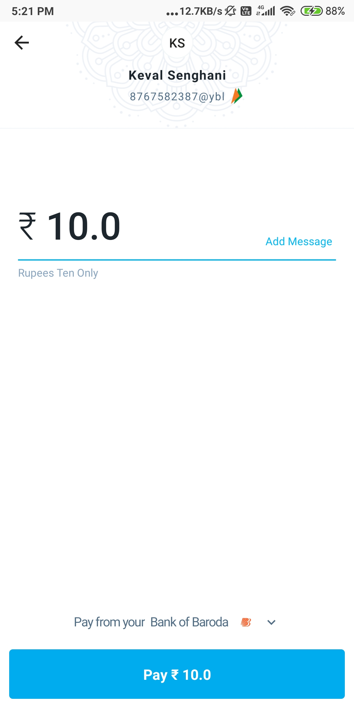

- UPI Payment Flutter App

This app first searches which all online payment platform available in your mobile and display all the app.

<h2>Demonstration Video:</h2>

<h2>ScreenShots:</h2>

 

 

# Support :

If you found this project helpful or you learned something from the source code and want to thank me, consider me to pay my internet bills. This would encourage me to create many such projects 👨🏻‍💻

<ul>
    <li><a href="https://www.paypal.me/kevalsenghani171"><b>PayPal</b></a></li>
    <li><b>Google Pay UPI ID :</b> senghanikeval@okhdfcbank</li>
</ul>
